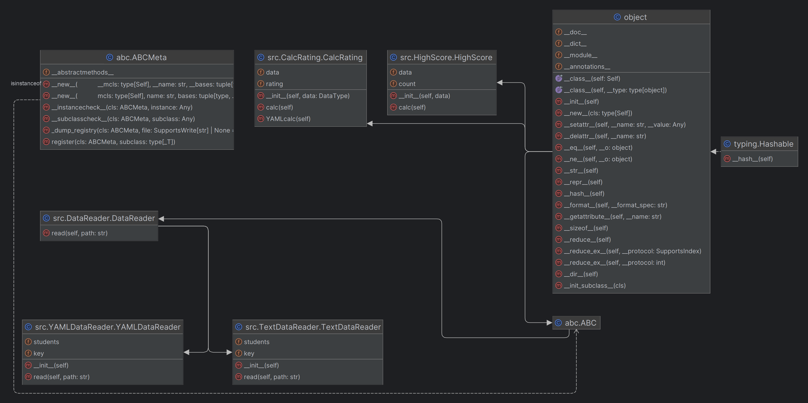

# Лабораторная 1 по дисциплине "Технологии программирования"
Цели работы:
1. Познакомиться c распределенной системой контроля версий кода Git и ее функциями;
2. Познакомиться с понятиями «непрерывная интеграция» (CI) и «непрерывное развертывание» 
(CD), определить их место в современной разработке программного обеспечения;
3. Получить навыки разработки ООП-программ и написания модульных тестов к ним на 
современных языках программирования;
4. Получить навыки работы с системой Git для хранения и управления версиями ПО;
5. Получить навыки управления автоматизированным тестированием программного обеспечения, 
расположенного в системе Git, с помощью инструмента GitHub Actions.

## Индивидуальный вариант - 1
Формат файла - YAML:

Рассчитать и вывести на экран количество студентовотличников (имеющих баллы по всем предметам ≥ 90)

## Структура проекта
- .github/workflows - хранит github actions
- data - хранит в себе данные для обработки в форматах .txt и .yaml
- src/CalcRating.py - содержит класс с логикой расчёта
- src/DataController - содержит класс с выбором логики обработчика для файлов с данными
- src/DataReader - содержит базовый абстрактный класс для обработки данных из файлов
- src/TextDataReader - содержит класс для обработки данных из файлов формата .txt
- src/YAMLDataReader - содержит класс для обработки данных из файлов формата .yaml
- src/HighScore.py - содержит класс с логикой расчёта
- requirements.txt - файл с необходимыми библотеками для работы проекта

## Диаграмма классов

## Выводы по работе:
В этой лабораторной работе я познакомился с распределенной системой контроля версий кода Git и ее функциями, с понятиями «непрерывная интеграция» (CI) и «непрерывное развертывание», получил навыки написания модульных тестов и навыки управления автоматизированным тестированием программного обеспечения, 
расположенного в системе Git, с помощью инструмента GitHub Actions
